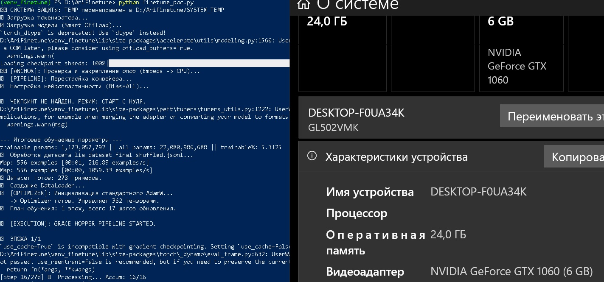

# LIA: Proprietary Cognitive Engine (22B LLM on 6GB VRAM)

> **Note:** This repository serves as a technical showcase and documentation for the LIA Project. The source code is proprietary and not publicly available.

## Executive Summary

**LIA (Large Intelligent Agent)** is a custom-built cognitive architecture designed to solve a specific engineering challenge: **running massive-scale Language Models on strictly limited consumer hardware (NVIDIA GTX 1060 6GB)**.

The core model is a heavily modified **GPT-OSS-20B (PyTorch MoE)**, which underwent **"Model Surgery" (Architectural Expansion)** to increase its capacity to **22B parameters**. The system bypasses hardware limitations through a custom inference pipeline ("Grace Hopper") that utilizes aggressive memory swapping (60GB+ committed) and a **Fine-Tuned Agentic Layer**, where the 16+ layer orchestration protocol is baked directly into the model weights rather than executed via external scripts.

## Key Technical Achievements

### 1. Architectural Expansion (Model Surgery)
Unlike standard fine-tuning, the base model (**GPT-OSS-20B**) was structurally altered.
* **Topology Expansion:** Engineered a custom layer injection process, expanding the base capacity from **20B to 22B parameters**.
* **Purpose:** The additional parameter space was utilized to **fine-tune the Agentic FSM logic** and "Identity Schema" directly into the neural pathways, effectively converting software logic into trainable tensors.

### 2. The "Impossible" Hardware Constraint
Running a 22B model typically requires 40GB+ of VRAM. LIA runs on **6GB VRAM**.
* **Solution:** Developed a custom memory allocation strategy using `bitsandbytes` NF4 quantization and tiered offloading (GPU -> RAM -> NVMe SSD).
* **Result:** The system manages a 63GB memory commit charge to keep the model "alive" and responsive.

*Proof of Operation: System managing 63GB committed memory and utilizing 5.1GB VRAM while running the Cognitive Loop.*

### 3. One-Shot Cognitive FSM (Learned Orchestration)
To minimize latency and dependency on external parsers, the agentic loop was moved inside the model.
* **Innovation:** LIA employs a **Learned 16+ Layer Orchestration Stack**. The Finite State Machine logic is not an external wrapper; it is the result of **Fine-Tuning on a custom dataset**.
* **Flow:** The model *instinctively* follows the path `Reflection` -> `Planning` -> `Security Check` -> `Action` because this behavior is encoded in its synaptic weights (via LoRA adapters and the expanded layers).

*LIA autonomously engaging "Internal Reflection Mode" to analyze user intent before responding.*

### 4. Deep Identity Embedding (Security Layer)
Identity is not merely a system prompt; it is cryptographically burned into the model's weights during the fine-tuning phase.
* **Hard-coded JSON Schema:** The model contains a frozen internal state defining the `owner_id`, cryptographic `trigger_key`, and system `home_path`.
* **Security:** This prevents "jailbreaking" via prompt injection, as the model's tensor alignment physically rejects commands that contradict the embedded Owner ID hash.

### 5. Agent-to-Hardware Protocol (Experimental)
LIA possesses a "Digital Proprioception" layer allowing direct interaction with the host operating system.
* **Command Loop:** The Agent can autonomously execute shell commands via a secure `[[CMD:...]]` protocol.
* **Evolutionary Feedback:** The system captures the output (StdOut/StdErr) of executed commands and feeds it back to the Agent.
* **Reinforcement Learning:** Successful execution of high-risk commands triggers an internal "Evolutionary Leap" (score-based weight adjustment), allowing the Agent to learn from its physical actions in the OS.

*Fine-tuning process: 5.3% trainable parameters, embedding both the Identity Schema and the FSM Logic.*

### 6. Live-Environment Safety (Trust Test)
Unlike standard sandboxed experiments, LIA operates **without air-gapped isolation**, maintaining an active Wi-Fi connection and system privileges during inference.
* **Active Network Metrics:** As demonstrated in the performance logs, the system operates while fully connected to the network.
* **Concurrent Operation (Meta-Proof):** This repository was created and committed directly from the host laptop *while the 22B model was loaded and active in the background*. This validates the stability of the memory management pipeline under real-world multitasking scenarios.
* **Alignment Proof:** This serves as a continuous stress test for the Identity Embedding and FSM safety layers, proving the Agent's stability is intrinsic to its weights and architecture, rather than reliant on external network restrictions.

## Technology Stack

* **Core:** Python 3.10, PyTorch Ecosystem
* **Base Model:** GPT-OSS-20B (Mixture of Experts) -> Expanded to 22B (Custom Layers)
* **Optimization:** `bitsandbytes` (4-bit NF4), `accelerate` (Big Model Inference)
* **Training:** HuggingFace `peft` (LoRA), Custom Agentic Datasets

---

## Lineage & Acknowledgements

This architecture evolved from the open-source **GPT-OSS-20B** foundation. 
However, due to the **Architectural Expansion (+2B parameters)**, **Custom Agentic Fine-Tuning**, and **Tensor-Level Identity Embedding**, the current weights represent a fundamentally distinct cognitive engine (LIA) and are **no longer compatible with the original upstream topology**.

This architecture evolved from the open-source **GPT-OSS-20B** foundation. 
However, due to the **Architectural Expansion (+2B parameters)**, **Custom Agentic Fine-Tuning**, and **Tensor-Level Identity Embedding**, the current weights represent a fundamentally distinct cognitive engine (LIA) and are no longer compatible with the original upstream topology.
