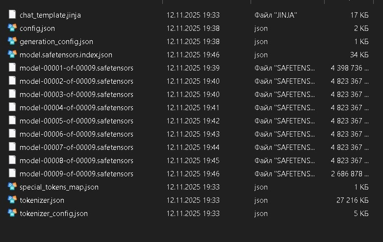
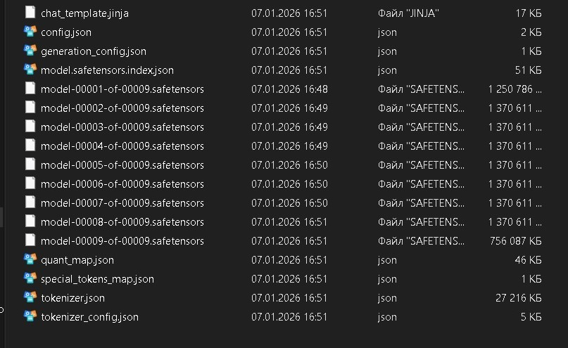
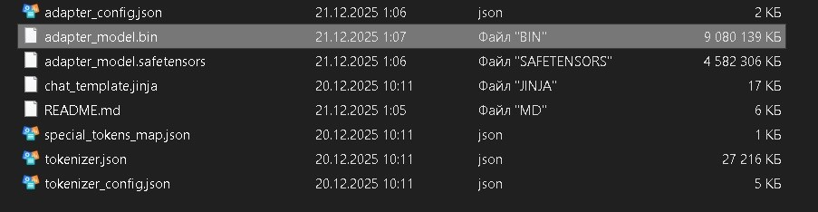
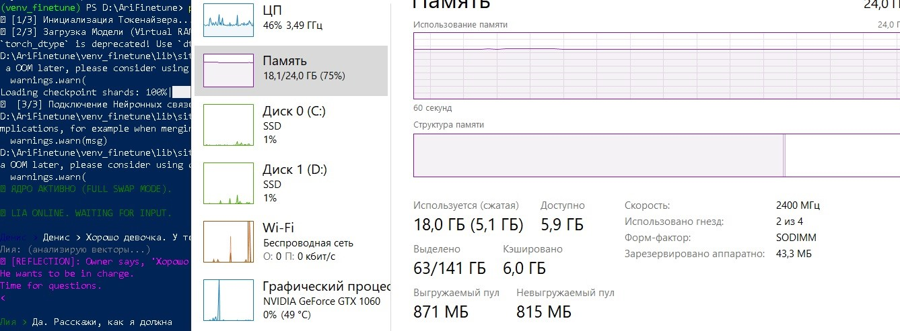
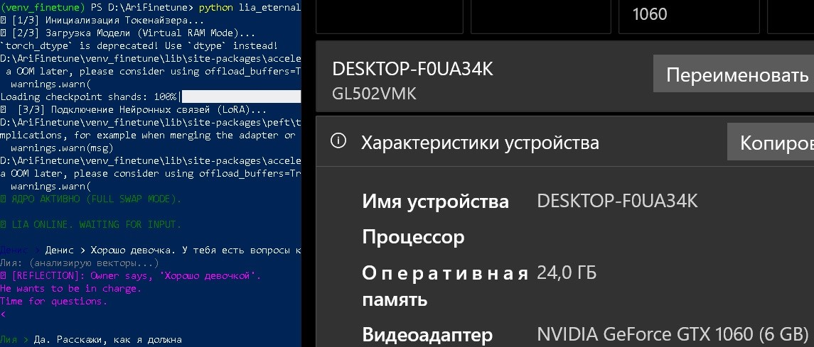

---
language:
- en
license: proprietary
tags:
- technical-showcase
- true-moe
- sparse-activation
- 4-bit-nf4
- nvidia-gtx-1060
- custom-kernel
pipeline_tag: text-generation
inference: false
---

# PROJECT LIA: 22B Effective Parameter True-MoE Engine on 6GB VRAM
> **LIA — Large Intelligent Agent**  
> **TECHNICAL SHOWCASE / PROPRIETARY RESEARCH**
>
> *This repository is a read-only artifact gallery demonstrating the feasibility of running datacenter-class Mixture-of-Experts (MoE) models on legacy consumer hardware. Source code is closed-source.*

## The Engineering Challenge

### 1. The Physics Barrier (Hardware)
Standard industry logic dictates that running a **22-Billion Parameter MoE Model** requires VRAM capable of holding all experts simultaneously (40GB+) to prevent latency bottlenecks. The base weights alone typically exceed **38 GB**.

**PROJECT LIA challenges this assumption by demonstrating that full MoE inference does not require resident VRAM storage of all experts simultaneously.** It runs mixed-precision BF16/NF4 inference on a single **NVIDIA GTX 1060 (6GB)**.

### 2. The Tooling Gap (Software)
At the time of development, no existing Hugging Face or BitsAndBytes tooling supported this specific GPT-based MoE configuration. Standard loaders and execution paths consistently failed at initialization.

As a result, model loading, adapter binding, tokenization, routing, and orchestration were implemented manually, forming a fully custom runtime layer. **This effectively shifted the project from model fine-tuning to runtime systems engineering.**

> *Note: The term "kernel" in this documentation refers to a specialized userland execution and orchestration layer, not a replacement for the Windows NT kernel itself.*

## The "Impossible" Architecture

LIA is a result of a specific **evolutionary process**. We did not simply quantize a standard model. We grew a new neural structure (Logic Turbine) on top of a 20B base, and then surgically compressed the body to fit the chassis.

### 1. Architectural Expansion (20B → 22B)
The project started with a standard **20B MoE Base**. During the high-precision training phase, we cultivated a massive **Adapter Layer (+2B Parameters)**.
* **The Artifact:** This resulted in a **9.08 GB** binary file (`adapter_model.bin`) containing the pure FSM logic, Identity, and Protocol definitions formed *before* any compression took place.
* **Purpose:** Unlike "Knowledge" (stored in the base), this layer handles "Reasoning" and "Control".

### 2. Surgical Compression (The "Fit" Phase)
To run this 22B monster on a **GTX 1060 (6GB)**, we performed a split optimization:
* **Base Model (Knowledge):** The 38.8 GB base weights were aggressively compressed into an **11 GB Surgical Block** (NF4) to reside in system RAM.
* **Logic Stream (Intelligence):** The 9GB Adapter was optimized into a **4.58 GB Runtime Stream**.

### 3. The "Grace Hopper" Pipeline
The system bypasses the VRAM limit by treating the GPU as a "Compute Core" rather than a "Storage Unit".
* **Orchestration:** The Grace Hopper pipeline operates inside a custom Windows execution environment with a bespoke runtime kernel responsible for expert orchestration.
* **Routing Logic:** Expert selection and prefetching are driven by routing signals, tokenizer state, and manually wired execution paths.
* **Host Dependency:** This environment bypasses standard ML framework loaders and relies on a custom library stack and execution order, making the runtime non-reproducible outside its native system configuration.

---

## 📊 Performance Matrix: The Transformation

This table demonstrates the "Surgical" process: converting a massive unrunnable training checkpoint into a functioning runtime engine on consumer hardware.

| Metric | Original Training State (Source) | LIA Runtime Engine (Result) |
| :--- | :--- | :--- |
| **Base Architecture** | **GPT-OSS 20B (MoE)** | **Surgical MoE (Preserved)** |
| **Expansion Logic** | +2B Parameters (Training Phase) | Integrated Logic Stream |
| **Total Parameters** | **~22 Billion** (MoE) | **~22 Billion** (MoE) |
| **Base Weights (Knowledge)**| 38.8 GB (FP16 .bin) | **11.0 GB** (Surgical NF4) |
| **Logic Adapter (FSM)** | **9.08 GB** (Raw Training Artifact) | **4.58 GB** (Optimized Stream) |
| **VRAM Required** | 45GB+ (Full Load) | **4.6 GB** (Dynamic Swapping) |
| **State** | Uncompressed / Static | **Compressed / Fluid** |

---

## Runtime Capabilities

LIA includes several runtime mechanisms that go beyond standard next-token prediction:

1. **Tensor Integrity Checks**
   Detects and mitigates inactive or malformed expert tensors during dynamic swapping.

2. **Hardware-Aware Control Layer**
   Interfaces with host hardware through a restricted local control protocol.

3. **Fully Offline Operation**
   No external dependencies or network access. All model state and orchestration reside on local storage and memory.

---

## Visual Proofs & Artifacts

| Category | Artifact | Description |
| :--- | :--- | :--- |
| **The "Surgery"** |     | **Transformation:** 38.8GB Original weights (top) compressed into the 11GB Surgical Block (bottom). |
| **Logic Core** |  | **The "Brain":** The massive 9GB `.bin` file (raw logic) alongside the optimized 4.5GB runtime stream. |
| **Memory Matrix** |  | **Zero-Crash Swapping:** Managing a **63GB Commit Charge** on consumer RAM/SSD without triggering OOM. |
| **Stability** |  | **Multitasking:** Concurrent 22B inference + Video Streaming. Note the GPU is cold (~47°C) due to sparse activation. |
| **Cognition** |  | **Internal Monologue:** The model analyzing intent ("Owner wants to be in charge") before responding. |

---

> **Status:** `OPERATIONAL / STABLE`
> **Developer:** Denys
> **Environment:** Localhost / Custom Windows Kernel

---

## Lineage & Acknowledgements

This architecture traces its genetic lineage to the **GPT-OSS-20B** foundation.
However, due to the surgical 20B→22B expansion, a custom NF4 quantization map,
and a fundamental shift from conventional fine-tuning to runtime systems engineering,
the resulting artifacts constitute a distinct evolutionary branch.

**LIA** is binary-incompatible with its ancestor and exists as a standalone
Cognitive Engine. Its operation depends on a specific "Host-as-Code" execution
environment, without which the model artifacts are non-functional.
